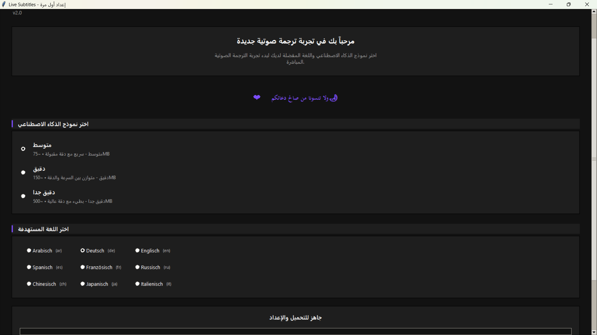

# Live Subtitles | Live-Untertitel

<b>Real-time system audio to text transcription | Echtzeit-Transkription von System-Audio in Text</b>

---

## 📋 Description | Beschreibung
Live Subtitles is an open-source application that converts system audio and microphone input into real-time text transcriptions, making it ideal for lectures, meetings, videos, and other audio content.

Live Subtitles ist eine Open-Source-Anwendung, die Systemaudio und Mikrofoneingang in Echtzeit in Text umwandelt – ideal für Vorlesungen, Meetings, Videos und andere Audioinhalte.

---

## ✨ Features | Funktionen
- ✅ **Real-time transcription** – Convert audio to text instantly  
- ✅ **Multiple languages** – Support for 9 different languages  
- ✅ **Various models** – Options to balance speed and accuracy  
- ✅ **Elegant UI** – Transparent and draggable with dark and light themes  
- ✅ **Keyboard shortcuts** – For quick application control  

---

## 🖼️ Screenshots | Bildschirmfotos

 <em>Main Interface - Live Subtitles in action</em>

 <em>With a settings Panel - Customize your experience</em>

---

## 📥 Download & Run | Download & Ausführen
1. Go to [Releases](#)  
2. Download the latest `LiveSubtitles.exe` file  
3. Run the executable – no installation required!  
4. The program will guide you through first-time setup  

---

## 💻 Source Code | Quellcode
- Clone or download the source code from [GitHub](#)  

---

## 🌐 Supported Languages | Unterstützte Sprachen
🇸🇦 Arabic | 🇩🇪 German | 🇬🇧 English | 🇪🇸 Spanish | 🇫🇷 French | 🇷🇺 Russian | 🇨🇳 Chinese | 🇯🇵 Japanese | 🇮🇹 Italian  

---

## ⌨️ Keyboard Shortcuts | Tastenkombinationen
- **S** – Show/hide text window  
- **O** – Open settings window  
- **Q** – Quit application  

---

## 🧠 Model Options | Modelloptionen
| Model  | Size   | Description |
|--------|--------|-------------|
| Tiny   | ~75MB  | Faster performance, lower accuracy |
| Small  | ~500MB | Good balance between speed and accuracy |
| Medium | ~1.5GB | Higher accuracy, slightly slower |

---

## 🔍 Troubleshooting | Fehlerbehebung
- Make sure your system meets the requirements (Windows 10/11, 4GB RAM)  
- Check if your antivirus is blocking the executable  
- For audio input issues, enable "Stereo Mix" in your sound settings  

---

## Acknowledgments | Danksagungen
- **OpenAI Whisper** – Speech-to-text model  
- **PyTorch** – Machine learning framework  
- **SoundDevice** – Audio processing  
- **WebRTC VAD** – Voice activity detection  

Entwickelt mit ❤️

